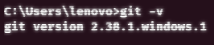
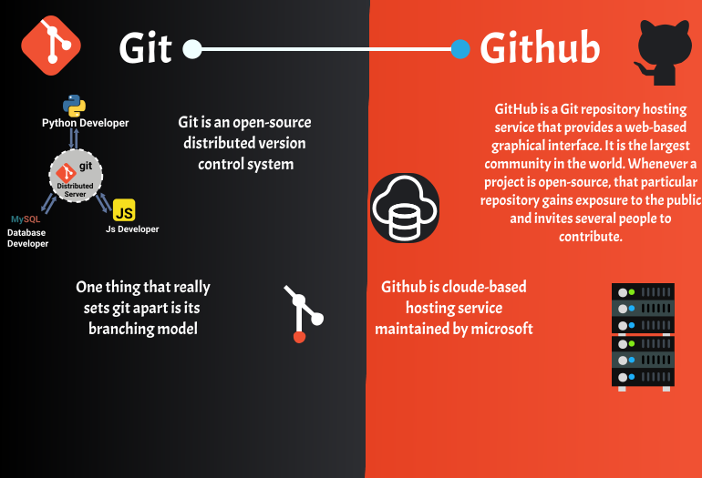

# Git-Github-Guide
## Content
|No.| Topic| Resources|
|---|---|---|
|1.|[Git](#what-is-git) |[link](/src/git-cheat-sheet-education.pdf)|
|3.|[Git Basic Commands](/src/gitcommands.md)|[link](/src/gitcommands.md)|
|4.|[Git and GitHub](#git-and-github)|[link](src/diffgitgithub.svg)|
|5.|[GitHub](#github)|
|6.|[Open-source Contribution ](#what-is-version-control-system)|

---

#### Learning objectives
  In this module, you'll Learn:
- What git is
- what version control is
- Understand distributed version control systems, like Git

## What is git?

Git is a distributed `version control system` that tracks changes in any set of computer files, usually used for coordinating work among programmers who are collaboratively developing source code during software development.

### What is version control system?

Version control is the practice of `tracking` and managing changes to software/source code.

### How/why does version control tracks software code?

Let's understand why:

- In a large software there are millions of code written. to managing the code you use version control.
- If there is bug in latest version of your software you can easily switch to old or previous version of software.
- git have track record of every version and very minor to major versions of the software.

Let's understand How:

- Suppose you have file index.js

  ```javascript
  const name="sairaj";

  some code. then another contributor contribute

  const username="hemanta01";
  git capture snapshot of every changes
  thats how git is called version control system.
  it has the register of every changes in source code
  ```
### Distributed version control
Git is distributed, which means that a project's complete history is stored both on the client and on the server. You can edit files without a network connection, check them in locally, and sync with the server when a connection becomes available.

### Git terminology
To understand Git, you have to understand the terminology.
- ***Working tree:*** The set of nested directories and files that contain the project that's being worked on.
- ***Hash:*** The directory, located at the top level of a working tree, where Git keeps all the history and metadata for a project.
- ***Object:***
- ***Commit:*** This action takes its name from commits to a database. It means you are committing the changes you have made so that others can eventually see them, too.


- ***Branch:***
- ***Remote:***
- ***Commands, subcommands,*** and ***options:***

### The Git command line
To download the git in your system you can go through this *[link](https://git-scm.com/downloads)* According to your os you can easily install.

To verify the installation use this command
```
 git -v
```
||
|---|

### Basic Git commands
### *Follow this [**link**](src/gitcommands.md)*

---
### Summary
 You learned:
- An overview of Version Control Systems (VCS)
- Important Git terminology.
- How to configure Git.
- Some basic Git commands.

### Resources
If you'd like to dig deeper, here are more resources:

- Run the `git help tutorial` commands.
- Visit the [*Everyday Git*](https://git-scm.com/docs/everyday) site.
- Review [*Git and GitHub learning*](https://docs.github.com/en/get-started/quickstart/git-and-github-learning-resources) resources.
- Check out [*Git Pro Book*](https://git-scm.com/book/en/v2) | [*Git Docs*](https://git-scm.com/doc)
---

## Git and Github
||
|---|

---
## GitHub
Learning objectives
In this module, you will:

- Identify the fundamental features of GitHub
- Learn about repository management
- Gain an understanding of the GitHub flow, including branches,commits, and pull requests
- Explore the collaborative features of GitHub by reviewing issues and discussions
- Recognize how to manage your GitHub notifications and subscriptions