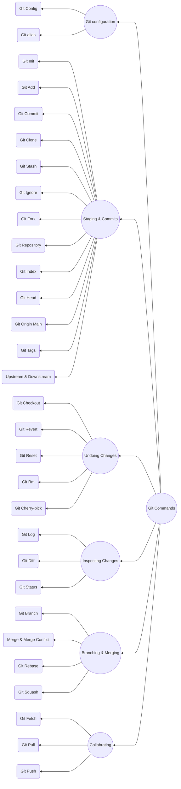

## Git Basic Commands [BACK](../README.md)



---
|No.|Content| link|
|---|---|---|
|1. |Git-configuration|[link](#1-git-configuration)|
|2. |Starting-a-project|[link](#2-starting-a-project)|
|3. |Local-changes|[link](#3-local-changes)|
|4. |Track-changes|[link](#4-track-changes)|
|5. |Commit-history|[link](#5-commit-history)|
|6. |Ignoring-files|[link](#6-ignoring-files)|
|7. |Branching|[link](#7-branching)|
|8. |Merging|[link](#8-merging)|
|9. |Remote|[link](#9-remote)|
|10. |Pushing-updates|[link](#10-pushing-updates)|
|11 |Pulling-updates|[link](#11-pulling-updates)|
|12. |Undo-changes|[link](#12-undo-changes)|
|13. |Removing-files|[link](#13-removing-files)|

### 1. Git configuration

- Git config

Get and set configuration variables that control all facets of how Git looks and operates.
Set the name:

```git
 git config --global user.name "User name"
 ```

Set the email:
```git
 git config --global user.email "nabi@gmail.com"
 ```
Set the default editor:
```git
 git config --global core.editor Code
 ```
Check the setting:

git config -list

Git alias

Set up an alias for each command:
- git config --global alias.co checkout
- git config --global alias.br branch
- git config --global alias.ci commit
- git config --global alias.st status
---
### 2. Starting a project

Create a local repository:
```git
 git init
 ```

Make a local copy of the server repository.

 ```git
 git clone
 ```
---
### 3. Local changes
 ```git
 git add
 ```
Add a file to staging (Index) area:
 ```git
 git add "Filename"
 ```

Add all files of a repo to staging (Index) area:
 ```git
 git add .
 ```

**Git commit**

Record or snapshots the file permanently in the version history with a message.
 ```git
 git commit -m " Commit Message"
 ```
---
### 4. Track changes
 ```git
Git diff
 ```
Track the changes that have not been staged:  `git diff`

Track the changes that have staged but not committed:
 ```git
  git diff --staged
```

Track the changes after committing a file:
 ```git
  git diff --staged
```

Track the changes between two commits:
git diff Git Diff Branches:
 ```git
  git branch
  git diff < branch 2>
```

Git status
Display the state of the working directory and the staging area.
 ```git
  git status
```
Git show Shows objects:
 ```git
  git show
```
---
### 5. Commit History

 ```git
  git log
```
Display the most recent commits and the status of the head:
 ```git
  git log
```
 git log
Display the output as one commit per line:
 ```git
  git log -oneline
```
Displays the files that have been modified:
 ```git
   git log -stat
```

Display the modified files with location:
 ```git
   git log -p
```
**5.6 `Git blame`**

Display the modification on each line of a file:
 ```git
  git blame <file name>
```
---
### 6. Ignoring files

**6.1. `.gitignore`**

Specify intentionally untracked files that Git should

ignore. Create .gitignore:

 touch .gitignore List the ignored files:

 ```
 git ls-files -i --exclude-standard
 ```

---
### 7. Branching

Git branch Create branch:

 git branch List Branch:

 git branch --list Delete a Branch:

 git branch -d Delete a remote Branch:

 git push origin -delete Rename Branch:

 ```git
    git branch -m
 ```

Git checkout

Switch between branches in a repository.

Switch to a particular branch:

 ```
 git checkout
 ```

Create a new branch and switch to it:

 git checkout -b Checkout a Remote branch:

 ```
 git checkout
 ```

- ***Git stash***

Switch branches without committing the current branch. Stash 
current work:

``` 
git stash
```

Saving stashes with a message:

 ```
 git stash save ""
 ```

Check the stored stashes:

``` 
git stash list
```

Re-apply the changes that you just stashed:

 ```
 git stash apply
 ```

Track the stashes and their changes:

 ```
 git stash show
 ```

Re-apply the previous commits:

 ```
 git stash pop
 ```

Delete a most recent stash from the queue:

 ```
 git stash drop
 ```

Delete all the available stashes at once:

 ```
 git stash clear
 ```

Stash work on a separate branch:

``` 
git stash branch
```

Git cherry pic

Apply the changes introduced by some existing commit:

 ```
 git cherry-pick
 ```

---
### 8. Merging

Git merge

Merge the branches:

 ```git
  git merge
  ```

Merge the specified commit to currently active branch:

 ```
 git merge
 ```

Git rebase

Apply a sequence of commits from distinct branches into a 
final commit.

 ```
 git rebase
 ```

Continue the rebasing process:

 git rebase -continue Abort the rebasing process:

 ```
 git rebase --skip
 ```

Git interactive rebase

Allow various operations like edit, rewrite, reorder, and 
more on existing commits.

 ```
 git rebase -i
 ```

---
### 9. Remote

Git remote

Check the configuration of the remote server:

 ```
 git remote -v
 ```

Add a remote for the repository:

 git remote add Fetch the data from the remote server:

 ```
 git fetch
 ```

Remove a remote connection from the repository:

 ```
 git remote rm
 ```

Rename remote server:

 ```
 git remote rename
 ```

Show additional information about a particular remote:

 ```
 git remote show
 ```

Change remote:

 ```
 git remote set-url
 ```

Git origin master

Push data to the remote server:

 git push origin master Pull data from remote server:

 ```
 git pull origin master
 ```

---
### 10. Pushing Updates

Git push

Transfer the commits from your local repository to a remote 
server. Push data to the remote server:

 git push origin master Force push data:

 ```
 git push -f
 ```

Delete a remote branch by push command:

 ```
 git push origin -delete edited
 ```

---
### 11. Pulling updates

Git pull

Pull the data from the server:

 ```
 git pull origin master
 ```

Pull a remote branch:

 ```
 git pull
 ```

Git fetch

Download branches and tags from one or more repositories. 
Fetch the remote repository:

 git fetch< repository Url> Fetch a specific branch:

 ```
 git fetch
 ```

Fetch all the branches simultaneously:

 ```
 git fetch -all
 ```

Synchronize the local repository:

 ```
 git fetch origin
 ```

---
### 12. Undo changes

Git revert

Undo the changes:

 ```
 git revert
 ```

Revert a particular commit:

 ```
 git revert
 ```

Git reset

Reset the changes:

 ```
 git reset -hard
 ```

 git reset -soft:

 ```
 git reset --mixed
 ```

---
### 13. Removing files

Git rm

Remove the files from the working tree and from the index:

 ```
 git rm <file Name>
 ```
 
Remove files from the Git But keep the files in your local 
repository:

 ```
 git rm --cached
 ```
 
